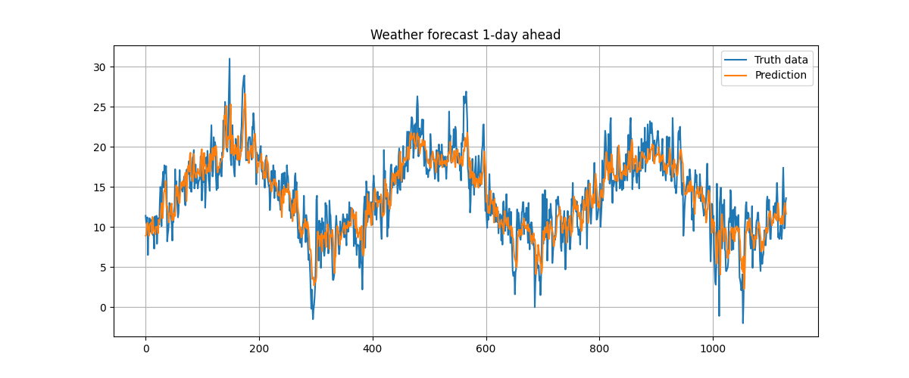
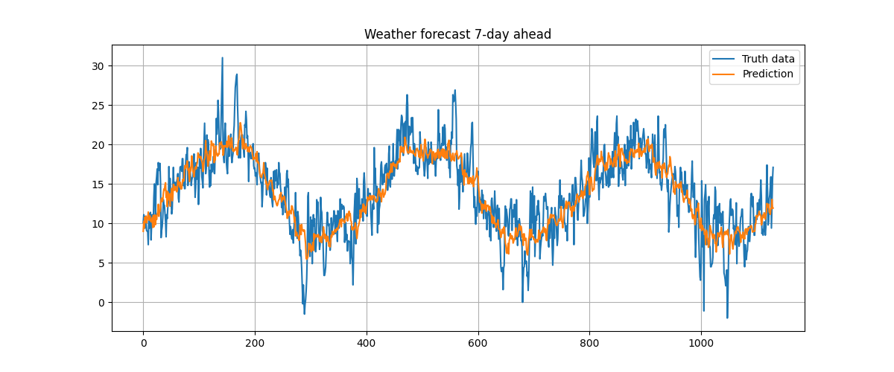

# Weather forecast using Machine learning

## Features:
- Weather prediction (1-day ahead and 7-day ahead)
- ML Models (Decision tree, Random forest)
- Run the script

## Run the code

###  Install the Project

```bash
git clone https://github.com/benjaminbenteke/Weather_Forecast.git
```

```bash
cd Weather_Forecast
```
### Virtual environment creation

#### On Mac OS and Linux

```bash
python3 -m venv myenv
```

#### On Windows
```bash
python -m venv myenv
```

### Activate your environment on Mac and Linux

```bash
source myenv/bin/activate
```

### Activate your environment on Windows

```bash
myenv\Scripts\activate
```

## Requirement installations
To run this, make sure to install all the requirements by:

```bash
pip install -r requirements.txt 
```

## List of targets:
```bash
    - date, - maxtp, - mintp, -gmin, -rain, -cbl, -wdsp, -hm, -ddhm,
       -hg, -soil, -pe, -evap, -smd_wd, -smd_md, -smd_pd, -glorad
```   

## Install
```bash
python main.py --target target_name
```

#### Example of running with a specific target from the list of targets. 
```bash
python main.py --target maxtp
```

### Forecast Plots for each Horizon

<table>
  <tr>
    <th>Horizon +1 Day</th>
    <th>Horizon +7 Days</th>
  </tr>
  <tr>
    <td></td>
    <td></td>
  </tr>
</table>
